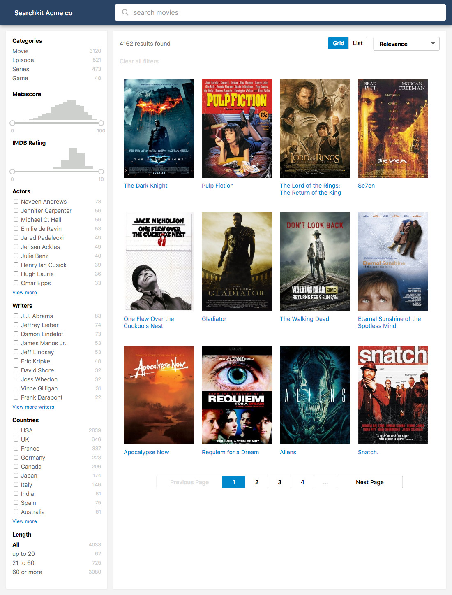
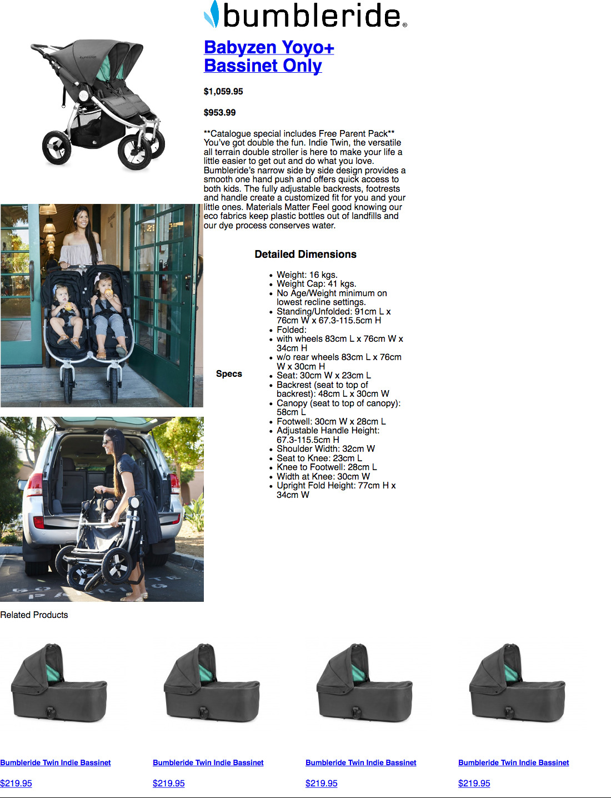

# design-detail-page

## Instructions

You need to build a detail page for an e-commerce selling baby products.
The theme of the detail page should be in the same tone as this page:
[http://demo.searchkit.co/](http://demo.searchkit.co/) but you should not reuse the css of `demo.searchkit.co`

Instead you will use the provided index.html that contains an inline 
version of purecss.io `https://purecss.io/`

The current index.html in just a bare html with very little styling:

You have use the inlined purecss + add your inline css in the `index.html` file to design this page.

### The challenge here is to design a theme that will look very close to demo.searchkit.co.

Exemple of websites that you could take example on are:

`https://www.babysavings.com.au/prams-and-strollers/brands/bumbleride/bumbleride-indie-twin.html`

or 

`https://www.babyandtoddlertown.com.au/cybex-priam-lux-seat-and-frame-special-edition-jeremy-scott-wings`

NOTE: YOU SHOULD AVOID USING THE style="" ATTRIBUTE WITHIN THE HTML TAGS.
The page should be responsive.
